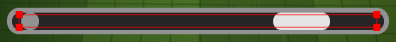

# ⛏️ Mining Assistant

A lightweight automation tool designed to assist with mining actions in *RORVIK*. This tool simulates mouse interactions based on visual cues in a selected Region of Interest (ROI), automating the process of optimal mining.

---

> ⚠️ **Important Setup Step (For All Users)**

To ensure the tool works correctly, you **must align the *inside* of your mining bar with the red rectangle** shown when **"Setter Mode"** is enabled in the app.

If the rectangle does not properly enclose your mining bar, the program will fail to detect visual cues, and **mining automation will not function**.

Once properly positioned, please click "Save ROI" in order for the program to capture the designated area. Afterwards, you won't need to repeat this step.



🛠️ Depending on your PC’s performance, you may need to fine-tune some settings (like delay and polling interval) via the settings menu to achieve reliable behavior.

---
## 📥 Download & Install (Windows Only)

1. **Go to the [latest release](https://github.com/Cyrendex/rorvik-mining-assist/releases/latest).**
2. **Download the ZIP file** (e.g., `MiningHelper-v1.1.0.zip`).
3. **Extract the folder** to any location on your PC.
4. **Run `MiningHelper.exe`.**

✅ The application will remember your settings and ROI even after closing.  
🗑️ You can clear the log output using the trash icon in the GUI.  
🔒 No installation required. Portable and self-contained.

---

## 🛠️ Developer Setup (Python Required)

If you'd rather compile or run the project yourself, follow these steps:

### 1. Clone the Repo
```bash
git clone https://github.com/Cyrendex/rorvik-mining-assist.git
cd rorvik-mining-assist/mining_helper
```

### 2. Create & Activate a Virtual Environment

#### Windows
```bash
python -m venv venv
venv\Scripts\activate
```

#### macOS/Linux
```bash
python3 -m venv venv
source venv/bin/activate
```

### 3. Install Dependencies
```bash
pip install -r ../requirements.txt
```

### 4. Run the App
```bash
python main.py
```

---

## ⚙️ Customizable Settings

You can edit runtime behavior via the settings dialog in the GUI. These values are stored in `settings.json` and persist across sessions.

| Setting Name           | Description |
|------------------------|-------------|
| `DEFAULT_DELAY`        | Delay (in seconds) after mouse down before checking the ROI. Helps prevent premature polling. |
| `POLL_INTERVAL`        | Frequency of ROI analysis during mining. Reduce this if the dot is slipping past the bar too quickly. |
| `RESET_TIMEOUT`        | Timeout for mining cycle if no critical drop is detected. Prevents infinite loops. |
| `RECHECK_GRACE_PERIOD` | Wait time after re-engaging mining before checking the ROI again. Useful for tuning rhythm. |
| `MAX_REENGAGE_ATTEMPTS`| Maximum re-engagement attempts before giving up. Too many may cause infinite loops. |
| `DOT_GRAY`             | Internal gray value for the dot. **Don't change unless you know what you're doing.** |
| `FILL_GRAY`            | Internal gray value for the bar fill. **Do not change.** |
| `CRITICAL_GRAY`        | Internal gray value for the critical zone. Changing may break detection. |
| `TOLERANCE`            | How "loose" color matching is. Increase only if detection struggles (at the cost of accuracy). |

You can always click **"Reset to Default"** in the settings dialog to restore original values.

---

## 📁 Folder Structure

```
rorvik-mining-assist/
├── assets/
│   ├── clear_icon.svg
│   ├── logo.ico
│   └── logo.svg
├── mining_helper/
│   ├── __pycache__/
│   ├── config_manager.py
│   ├── constants.py
│   ├── controller.py
│   ├── detector.py
│   ├── gui_roi_setter.py
│   ├── main.py
│   ├── roi_config.json
│   ├── settings.json
│   └── settings_dialog.py
├── venv/
├── README.md
├── requirements.txt
└── .gitignore
```

---

## 🧠 Notes

- ❌ macOS/Linux support is currently untested due to the use of Windows-specific mouse handling and GUI behavior.
- 🛑 You are responsible for following game ToS. This tool does not guarantee ban safety.
- ✨ Suggestions and issues are welcome via [GitHub Issues](https://github.com/Cyrendex/rorvik-mining-assist/issues).

---

## 📦 Want to Build the .EXE Yourself?

You can create a Windows executable using [PyInstaller](https://pyinstaller.org/):
```bash
pyinstaller mining_helper/main.py --onefile --icon=assets/logo.ico --name=MiningHelper
```

Your executable will appear in the `dist/` folder. You can then zip it and distribute it via a GitHub release.

---

Happy mining! 💎